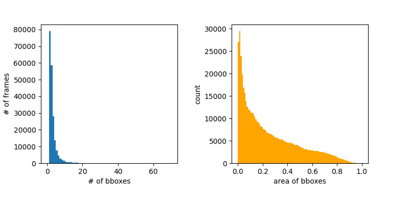

# AVA\_statistics

## What is it?
Generates statistical graphs 
(just like the ones in Figure 4 and Figure 5 of [the original paper](https://arxiv.org/pdf/2005.00214.pdf))
on the AVA dataset.

## Prerequisites
- Numpy
- Pandas 
- Matplotlib

Make sure you have downloaded annotation data from the [official cite](https://research.google.com/ava/download.html)

## Usage

```
vi draw_graph.py
```
Set variable `PATH_TO_CSV` to the csv file which contains the information of predicted boxes (i.e. `person_box_67091280_iou90/ava_train_predicted_boxes.csv`)

```
python draw_graph.py
```

Should draw a graph like the one below.


